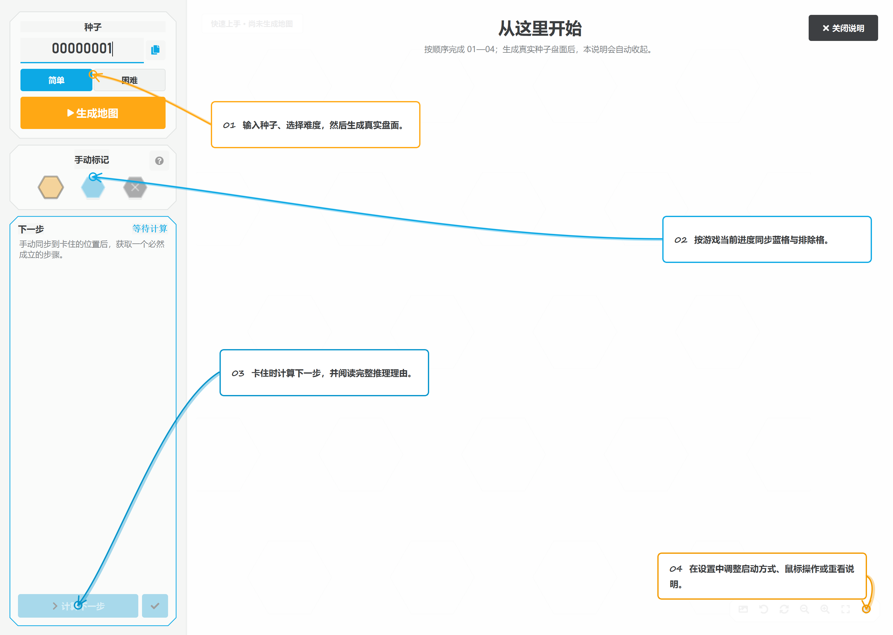
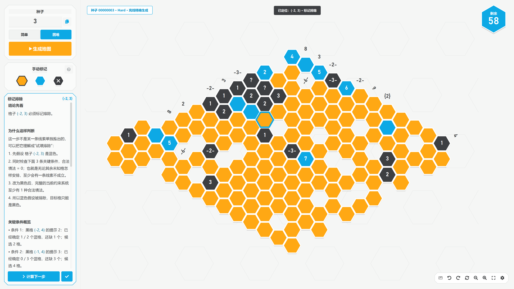
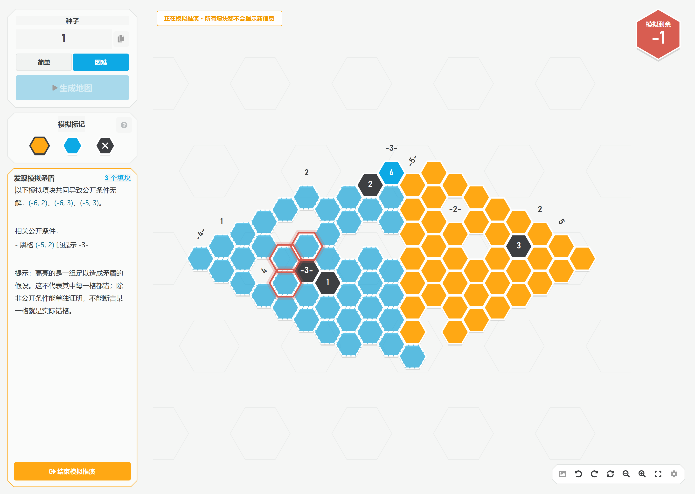

# HexInfinite 种子求解器

当前版本：`0.9.1`

这是一个面向 `Hexcells Infinite` 的 Windows 中文逐步求解器。输入种子号并选择 Easy/Hard 后，程序会在本地复刻原版地图，不再启动 `Hexcells Infinite.exe`；你可以手动同步当前进度，然后每次只获取一个必然步骤和中文理由。

## 下载 Windows 单文件版

从 [GitHub Release v0.9.1](https://github.com/Oblivionis-ling/hexsolver-cn-py/releases/tag/v0.9.1) 下载：

- `HexInfiniteSolver-0.9.1-windows-x64.exe`
- `HexInfiniteSolver-0.9.1-windows-x64.exe.sha256`

无需安装 Python、Conda 或项目依赖，下载后直接双击 EXE。`0.9.1` 将 CP-SAT 从首屏启动路径移到按需加载，并在窗口完成首次绘制后后台预热；恢复上次局面的确认框也改为主窗口可见后再显示、提升并请求焦点，不使用会干扰日常操作的永久置顶。`0.9.0` 的隔离模拟推演、求解结论和地图生成核心保持不变。

系统要求：Windows 10/11 x64。Hard 完全离线可用；Easy 仍需要本机合法安装 Steam 版 `Hexcells Infinite`，程序只读其 `Assembly-CSharp.dll` 并校验版本，不会把原游戏 DLL、EXE 或存档打进安装包。由于当前成品未做商业代码签名，Windows 首次下载时可能显示 SmartScreen 提示；请用 Release 同时提供的 SHA-256 文件核对完整性。








## 已可用

- 方案 2 双栏界面：左侧六边形控制轨，右侧大棋盘。
- Easy：最小 `UnityEngine` 兼容层直接执行原版托管类 `OldLevelGenerator + MarvinHexcellsSolver`，不加载 Unity、不启动游戏。
- Hard：纯 Python 精确移植原版 `LevelGenerator + Solver/Set`。
- 原版最终格子、公开/隐藏状态、数字/连续/非连续提示、花格和三方向行线索导入。
- 可缩放、平移、点击的独立棋盘。
- 未知 / 蓝色 / 排除三态手动同步；紧凑六边形图例通过颜色、图形、悬停提示和无障碍名称表达状态，选中轮廓依次使用黑色、橘色和蓝色，支持撤销、重做和重置。
- 设置页可选择原版式鼠标操作；开启后左键排除、右键标记蓝色，对同一状态再次按相同按键会恢复未知。该模式默认关闭，开启时手动状态按钮会暂时禁用，避免输入含义冲突。
- 应用默认以保留标题栏和系统任务栏的最大化窗口启动；设置页可改为无边框全屏或普通窗口，并在下次启动时遵循。
- 启动时不再显示模拟棋盘，而是以四个手绘箭头说明种子生成、手动同步、下一步推理和设置入口；可直接关闭，成功生成真实盘面后自动收起，也可从设置中重新查看。
- 用户确认揭开格子后，自动显示该格在原版中刚出现的数字、连续/非连续或花格提示；撤销时一并恢复覆盖状态。
- 局部规则、排列、子集差分、剩余数和 CP-SAT 全局兜底。
- 下一步严格按“局部计数 → 排列 → 子集差分 → 全场剩余 → 全局唯一性”逐层短路；找到更简单的全场必然步后，不再计算更复杂层级。
- 一次只高亮一个必然步骤，并显示可滚动、可核查的中文推理过程。
- 全局唯一性理由先给出结论和试填反证摘要，再提供关键条件、完整坐标核查与术语说明；第一次阅读可以跳过详细核查。
- 全局唯一性检查复用同一盘面的 CP-SAT 模型，只验证基础合法解的相反值，并用第二份合法解批量排除非固定格；代表 Hard 完整回放约快 10.8 倍，超时会安全回退。
- 当前真实盘面可一键进入模拟推演；进入时已有状态全部锁定，只有当时的未知格可以添加模拟蓝格或排除标记。
- 下一步操作栏使用紧凑的“计算下一步 / 应用 / 模拟”布局；模拟按钮完整显示两个字，同时保留烧瓶图标、完整提示和无障碍名称。
- 模拟标记使用半透明填充和虚线轮廓，不释放格内提示、不读取私有答案；推演期间“计算下一步”和应用建议完全关闭。
- 每次模拟修改后只用进入时已经公开的格内提示、行线索和剩余数检查可行性；若假设共同造成矛盾，会用红色双层轮廓高亮一组足以冲突的模拟填块。该集合不表示其中某个单格已被证明是实际错格，未发现矛盾也不表示假设已经被证明正确。
- 模拟推演拥有独立的撤销、重做和重置；结束后丢弃整个模拟分支，真实盘面、正常撤销记录和自动存档保持不变。
- 恢复局面、清除进度和删除缓存均使用不受系统深色主题影响的浅色确认框，按钮直接说明操作结果。
- 应用当前建议的勾选按钮不再弹出悬停说明；功能保持为直接把当前必然步应用到本地盘面，并保留无障碍名称。
- 推理中的单个坐标、完整坐标数组和“横向 / 左下斜 / 右下斜”行引用可与棋盘联动；悬停不弹提示框，使用外层轻柔光与内层细虚线做一次性淡入预览，点击固定后改为静态实线、文字加粗，数组成员会作为一个整体同时高亮。
- 点击是悬停之外的完整替代操作；键盘聚焦引用后按 Enter/空格也可固定或取消。切换步骤、应用、撤销、重置或换图会自动清理交互状态。
- 推理原因区域占据侧栏剩余空间，滚动正文与固定操作栏严格分离，长解释可完整查看；界面不再显示步骤历史和重复的“剩余/冲突”统计卡。
- 推理文档末尾具有独立安全区；无论全屏、默认窗口还是最小窗口，滚动到底后最后一行都会完整停在按钮栏上方。
- 三个方向的所有行线索始终显示在棋盘上层，并为顶部、右侧和工具栏预留安全边距。
- 公开盘面与私有答案隔离；答案只用于测试核对，不参与推理。
- 生成和下一步推理都在后台线程中运行；盘面在推理期间发生变化时，旧结果会被自动丢弃。
- 当前真实局面自动原子保存；启动时可选择继续，设置页可关闭询问、手动保存或载入 `.hexsave`，以及清除当前进度。存档包含版本和完整性校验。
- 恢复确认只在主窗口已经可见后出现，并作为主窗口的模态子窗口请求前台焦点；关闭确认框后不会留下任何永久置顶状态。
- Easy/Hard 精确生成结果自动保存为经过字段校验的版本化 JSON；损坏或过期缓存会被忽略并重新生成，界面会明确区分“离线精确生成”和“本地缓存”。
- 右下角齿轮打开独立设置页；当前可管理窗口模式、局面进度、使用说明、原版式左右键操作和种子结果缓存。
- 截图/OCR 导入入口当前暂时关闭；识图到地图的转换逻辑完成重做和精度验证后再重新开放。

## 精确性边界

Easy/Hard 默认后端都不会启动游戏，也不是近似算法：

- Easy 只读取原版托管程序集，使用项目内的无 Unity 宿主直接执行生成器与 Marvin 求解器。
- Hard 已将生成器、`Solver/Set`、原版排序与 Unity RNG 行为移植为纯 Python。

Easy 托管程序集固定检查以下基线：

- Steam Build ID：`5455383`
- Unity：`5.6.3f1`
- 原始 `Assembly-CSharp.dll` SHA-256：`835DEC694D7685809EDAC963E0F47306AD4300C7D7C9C555AD457F20EFAA8083`

原 Steam 安装和原存档不会被修改。逆向与原版差分工具只存在于：

```text
D:\Desktop\HexInfinite\reverse_harness\game
```

当前验证结果：Easy/Hard seed 1–50 的最终 TSV 均逐字段一致，并额外通过 `00000000`、`99999999` 两个边界种子；Hard 样本覆盖五种地图形状。`0.4.1` 修正棋盘上下镜像，`0.4.2` 同步修正左右斜向标签，`0.4.3` 加入详细可核查推理；`0.5.0` 至 `0.7.1` 逐步完善封装、显示、缓存、输入和推理联动；`0.7.2` 优化推理层级调度；`0.7.3–0.7.4` 调整启动、设置和新手引导体验；`0.8.0` 增加后台推理、局面存取及完整撤销/重做；`0.8.1` 改善确认框和全局理由的表达与排版；`0.8.2` 在不改变结论的前提下优化全局求解性能；`0.9.0` 新增隔离模拟推演；`0.9.1` 缩短启动关键路径并修复恢复确认框的前台时序。seed 1/2 已与现有官方截图逐个核对轮廓和线索方位。`reverse_harness` 中的原版运行时桥只保留为显式差分校验工具，不在默认产品链路中。

性能边界：Easy 通常不到 1 秒；Hard 会忠实重放原版的多轮可解性验证与冗余线索裁剪，小图约数秒，少数复杂种子可能需要几十秒。首次生成始终在 UI 后台线程中执行；成功结果会自动缓存，相同 Build、后端、难度和种子的后续加载通常只需读取本地 JSON。

## 启动

普通用户优先使用 Release 中的 `HexInfiniteSolver-0.9.1-windows-x64.exe`，直接双击即可。

以下方式用于源码开发：

直接双击 `启动求解器.cmd`。首次启动会自动创建项目环境、安装依赖并构建 Easy 托管核心，之后会先完成离线诊断再打开界面。

也可以在 PowerShell 中运行：

```powershell
cd D:\Desktop\HexInfinite\hexsolver_cn_py
.\run.cmd
```

也可以直接运行：

```powershell
.\.conda_env\python.exe main.py
```

新环境安装：

```powershell
conda create -y -n hexsolver-cn python=3.11
conda run -n hexsolver-cn python -m pip install -r requirements.txt
conda run -n hexsolver-cn python main.py
```

## 使用流程

1. 输入十进制种子号。
2. 选择“简单”或“困难”，点击“生成地图”。
3. 等待状态从“正在离线生成”变为“离线精确生成”。
4. 默认可选择“未知 / 蓝色 / 排除”后左键点击棋盘；也可在设置中开启原版式操作，直接左键排除、右键标记蓝色。
5. 点击“计算下一步”。
6. 查看高亮目标、动作和中文理由；把鼠标移到理由中的坐标、坐标数组或行名称上可预览对应棋盘元素，点击可固定/取消联动。右侧勾选按钮可把建议应用到本地盘面。

需要试验假设时，点击下一步操作栏中的烧瓶入口进入模拟推演。推演会锁定当前真实盘面；使用蓝格或排除工具标记原本未知的格子，程序会在后台按公开线索检查矛盾。红色双层轮廓表示这一组模拟填块共同构成了一组充分冲突条件，不等于其中每个格都被单独证明错误。推演期间没有下一步推理；可使用独立撤销、重做和重置，完成后点击“结束模拟推演”丢弃所有假设并返回真实盘面。

首次启动先按手绘说明输入种子并生成地图；生成成功后说明自动收起。原版式操作下，对同一格再次使用相同按键会恢复未知。中键拖动棋盘，滚轮缩放。右下角可撤销、重做、重置、缩放、适合窗口并打开设置；`Ctrl+Z` 撤销、`Ctrl+Y` 重做。自动存档默认位于 `%LOCALAPPDATA%\HexInfiniteSolver\sessions\autosave.hexsave`，种子缓存位于 `%LOCALAPPDATA%\HexInfiniteSolver\seed-cache\v1`。截图按钮当前为禁用状态；当前请使用种子生成地图并手动同步游戏进度。

当前理由不再只显示一句结论：

- 局部计数会列出线索值、已知蓝格、未知格、还需蓝格和减法算式。
- 连续/非连续提示会列出合法排列数量、部分排列坐标和目标格在全部排列中的蓝/黑次数。
- 子集差分会展开两组未知集合、各自需求、差集坐标和需求差公式。
- 全盘剩余会直接比较剩余蓝格数与未知格数。
- CP-SAT 全局步骤先直接给出目标格结论，再用“假设相反颜色 → 关键条件下合法填法为 0 → 换回正确颜色至少存在一种合法填法”的试填过程解释；完整坐标核查移到后半部分，冲突集合不冒充唯一或数学上最小的证明。

## 诊断与测试

只检查离线核心、程序集版本和默认后端，不启动游戏：

```powershell
.\.conda_env\python.exe tools\doctor.py
```

离线生成 Easy/Hard seed 1，并核对第一条建议（仍不启动游戏）：

```powershell
.\.conda_env\python.exe tools\doctor.py --smoke-seed 1
```

逐步解完整个 seed，并逐步与私有答案核对：

```powershell
.\.conda_env\python.exe tools\doctor.py --smoke-seed 1 --full-replay
```

只验证某个难度可添加 `--difficulty easy` 或 `--difficulty hard`。

只有显式添加下面的参数，诊断工具才会启动隔离原版一次并做逐字段差分：

```powershell
.\.conda_env\python.exe tools\doctor.py --smoke-seed 1 --compare-original
```

执行自动测试：

```powershell
.\test.ps1
```

构建并验证 0.9.1 单文件成品：

```powershell
powershell.exe -NoLogo -NoProfile -ExecutionPolicy Bypass -File .\packaging\build_app.ps1
```

构建脚本会执行源码测试、构建 Easy 托管核心、生成单文件 EXE、检查归档不含原游戏程序集，并启动真实成品完成 UI + Easy/Hard seed 1 冒烟测试。详细边界见 [Windows 打包与发布](docs/PACKAGING.md)。

当前 102 项自动测试覆盖原有生成、求解和 UI 回归，并包含撤销/重做、存档门禁、后台推理、浅色确认框、新版全局理由结构、单模型复用、相反值检查、差异见证和超时安全回退。新增启动回归确保普通局部推理不提前导入 CP-SAT、后台预热后全局求解可用，以及恢复确认只在可见主窗口上显示并请求焦点；操作栏回归确保“模拟”和收窄后的“计算下一步”完整可读。模拟状态隔离、起始格锁定、不揭示私有提示、独立撤销/重做/重置、多人为假设共同冲突、后台结果过期保护和真实盘面恢复仍完整覆盖。Easy/Hard seed 1–50 及两个八位边界种子已做原版逐字段差分；代表种子还会完整解到零未知格并逐步核对私有答案。

复现 0.8.2 性能对照：

```powershell
.\.conda_env\python.exe .\tools\benchmark_solver_performance.py --repeat 3 --workers 1,2,4,8,12 --include-local-autosave
```

环境、原始数据、正确性门禁和未采用方案见 [0.8.2 性能试验记录](docs/performance/V082_EXPERIMENTS.md)。

仓库自带 `tests/fixtures/` 的 Easy/Hard seed 1 结构化夹具。没有原版程序集时，Easy 托管核心的真实集成项会明确跳过，其余单元测试和 Hard 离线测试仍可运行。

## 架构

```text
seed + difficulty
        |
        +--> Easy: headless managed core
        |          (OldLevelGenerator + Marvin)
        |
        +--> Hard: pure Python port
                   (LevelGenerator + Solver/Set)
        |
        v
public board + private answer
        |
        v
InteractivePuzzleSession
        +--> 正常模式：HexReasoningSolver.next_step()
        |              -> 目标格 + 动作 + 中文理由
        |
        +--> 模拟推演：SimulationSession(public board only)
                       -> 模拟标记 + 公开约束冲突集合
```

主要文件：

- `src/hexsolver_cn/app.py`：双栏桌面界面、后台生成/推理与交互编排。
- `src/hexsolver_cn/seed_cache.py`：种子结果缓存键、JSON 校验、原子写入、统计和清理。
- `src/hexsolver_cn/settings_dialog.py`：可扩展设置页和缓存管理界面。
- `src/hexsolver_cn/dialogs.py`：不受系统深色主题影响的浅色中文确认框。
- `src/hexsolver_cn/preferences.py`：用户体验选项的类型化持久化存储。
- `src/hexsolver_cn/managed_easy.py`：Easy 无 Unity 托管宿主后端，保证不启动游戏。
- `src/hexsolver_cn/hard_offline.py`：Hard 生成器与内置 `Solver/Set` 的纯 Python 精确移植。
- `src/hexsolver_cn/original_bridge.py`：TSV 解析、盘面转换，以及仅用于显式差分的原版隔离桥。
- `src/hexsolver_cn/board_view.py`：六边形 Qt 画布与行线索。
- `src/hexsolver_cn/reason_interaction.py`：推理引用解析、富文本悬停/固定状态和键盘交互。
- `src/hexsolver_cn/solver.py`：确定性局部规则与 CP-SAT 兜底。
- `src/hexsolver_cn/session.py`：当前局面、剩余数、撤销与重做。
- `src/hexsolver_cn/simulation.py`：隔离模拟分支、起始状态锁定及独立撤销/重做/重置。
- `src/hexsolver_cn/session_store.py`：版本化局面存档、完整性校验、原子写入和恢复。
- `src/hexsolver_cn/unity_random.py`：Unity 5.6.3f1 RNG 位兼容实现。
- `src/hexsolver_cn/hard_generator.py`：Hard 初始形状、颜色与 Unity 随机序列。
- `managed_core/`：C# 最小 Unity API 兼容层、Easy 宿主和一键构建脚本。
- `tools/doctor.py`：离线后端诊断；原版启动差分必须显式启用。
- `packaging/`：0.9.1 Windows 单文件构建、隔离 DLL 搜索路径、图标/版本资源和成品冒烟测试入口。

## 文档

- [开发历史](DEVELOPMENT_HISTORY.md)：从 `0.1.0` 截图原型到当前 `0.9.1` 版本。
- [工作区说明](docs/WORKSPACE.md)：本地目录、专有文件边界、清理与恢复规则。
- [求解算法](docs/solver/ALGORITHM.md)：局部规则、CP-SAT 和全局反证。
- [0.8.2 性能试验](docs/performance/V082_EXPERIMENTS.md)：可复现基准、线程对照、正确性门禁和方案取舍。
- [0.9.1 启动实验](docs/performance/V091_STARTUP_EXPERIMENTS.md)：启动关键路径、测量结果、未采用的打包裁剪和正确性门禁。
- [0.9.0 模拟推演需求](docs/design/V090_SIMULATION_REQUIREMENTS.md)：公开信息边界、冲突语义和验收标准。
- [Windows 打包与发布](docs/PACKAGING.md)：单文件内容、构建、验证和专有文件边界。
- [种子开发清单](docs/generator/IMPLEMENTATION_PLAN.md)：实现模块与验收标准。
- [完整文档索引](docs/README.md)。
