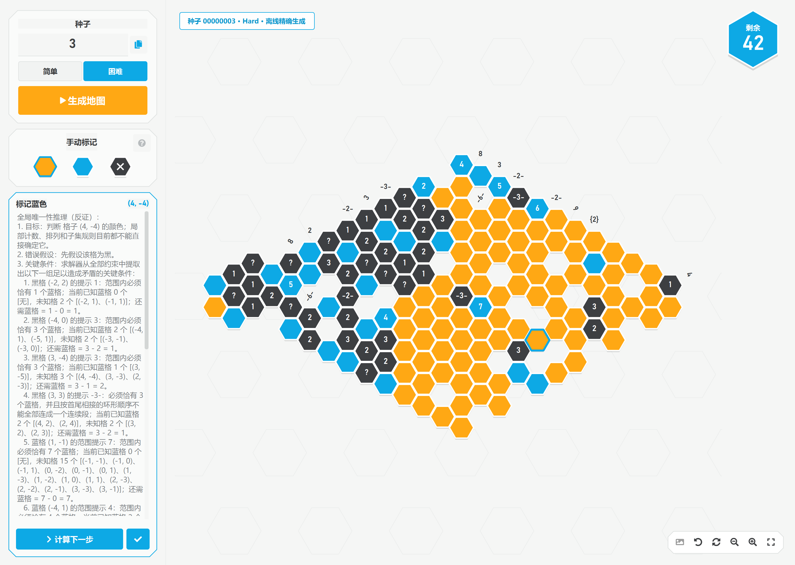
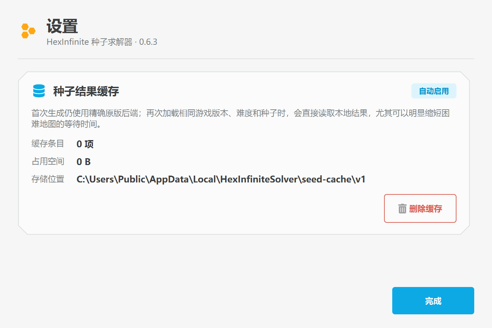

# HexInfinite 种子求解器

当前版本：`0.6.3`

这是一个面向 `Hexcells Infinite` 的 Windows 中文逐步求解器。输入种子号并选择 Easy/Hard 后，程序会在本地复刻原版地图，不再启动 `Hexcells Infinite.exe`；你可以手动同步当前进度，然后每次只获取一个必然步骤和中文理由。

## 下载 Windows 单文件版

从 [GitHub Release v0.6.3](https://github.com/Oblivionis-ling/hexsolver-cn-py/releases/tag/v0.6.3) 下载：

- `HexInfiniteSolver-0.6.3-windows-x64.exe`
- `HexInfiniteSolver-0.6.3-windows-x64.exe.sha256`

无需安装 Python、Conda 或项目依赖，下载后直接双击 EXE。`0.6.3` 沿用同一套生成器和求解器核心，增加自动种子结果缓存和可扩展设置页；相同版本、难度和种子的困难地图第二次打开时可直接从本地缓存加载。

系统要求：Windows 10/11 x64。Hard 完全离线可用；Easy 仍需要本机合法安装 Steam 版 `Hexcells Infinite`，程序只读其 `Assembly-CSharp.dll` 并校验版本，不会把原游戏 DLL、EXE 或存档打进安装包。由于当前成品未做商业代码签名，Windows 首次下载时可能显示 SmartScreen 提示；请用 Release 同时提供的 SHA-256 文件核对完整性。





## 已可用

- 方案 2 双栏界面：左侧六边形控制轨，右侧大棋盘。
- Easy：最小 `UnityEngine` 兼容层直接执行原版托管类 `OldLevelGenerator + MarvinHexcellsSolver`，不加载 Unity、不启动游戏。
- Hard：纯 Python 精确移植原版 `LevelGenerator + Solver/Set`。
- 原版最终格子、公开/隐藏状态、数字/连续/非连续提示、花格和三方向行线索导入。
- 可缩放、平移、点击的独立棋盘。
- 未知 / 蓝色 / 排除三态手动同步；紧凑六边形图例通过颜色、图形、悬停提示和无障碍名称表达状态，支持撤销和重置。
- 用户确认揭开格子后，自动显示该格在原版中刚出现的数字、连续/非连续或花格提示；撤销时一并恢复覆盖状态。
- 局部规则、排列、子集差分、剩余数和 CP-SAT 全局兜底。
- 一次只高亮一个必然步骤，并显示可滚动、可核查的中文推理过程。
- 推理原因区域占据侧栏剩余空间，滚动正文与固定操作栏严格分离，长解释可完整查看；界面不再显示步骤历史和重复的“剩余/冲突”统计卡。
- 三个方向的所有行线索始终显示在棋盘上层，并为顶部、右侧和工具栏预留安全边距。
- 公开盘面与私有答案隔离；答案只用于测试核对，不参与推理。
- 生成在后台线程中运行，期间有明确加载、禁用和失败重试状态。
- Easy/Hard 精确生成结果自动保存为经过字段校验的版本化 JSON；损坏或过期缓存会被忽略并重新生成，界面会明确区分“离线精确生成”和“本地缓存”。
- 右下角齿轮打开独立设置页；当前可查看缓存条目数、占用空间和存储位置，并在确认后删除全部种子结果缓存。
- 截图/OCR 导入入口当前暂时关闭；识图到地图的转换逻辑完成重做和精度验证后再重新开放。

## 精确性边界

Easy/Hard 默认后端都不会启动游戏，也不是近似算法：

- Easy 只读取原版托管程序集，使用项目内的无 Unity 宿主直接执行生成器与 Marvin 求解器。
- Hard 已将生成器、`Solver/Set`、原版排序与 Unity RNG 行为移植为纯 Python。

Easy 托管程序集固定检查以下基线：

- Steam Build ID：`5455383`
- Unity：`5.6.3f1`
- 原始 `Assembly-CSharp.dll` SHA-256：`835DEC694D7685809EDAC963E0F47306AD4300C7D7C9C555AD457F20EFAA8083`

原 Steam 安装和原存档不会被修改。逆向与原版差分工具只存在于：

```text
D:\Desktop\HexInfinite\reverse_harness\game
```

当前验证结果：Easy/Hard seed 1–50 的最终 TSV 均逐字段一致，并额外通过 `00000000`、`99999999` 两个边界种子；Hard 样本覆盖五种地图形状。`0.4.1` 修正了 Unity 世界坐标到 Qt 画布时 Y 轴方向相反造成的棋盘上下镜像；`0.4.2` 同步交换了镜像后的左右斜向标签；`0.4.3` 将所有步骤理由升级为详细可核查推理；`0.5.0` 封装为 Windows x64 单文件应用；`0.6.1` 扩大推理说明区、移除步骤历史展示并保证全部行线索常显；`0.6.2` 将长推理正文与按钮栏彻底分离、精简手动图例并删除重复统计卡；`0.6.3` 只在生成流程外层增加安全缓存和设置管理，仍未修改任何推理或生成算法。seed 1/2 已与现有官方截图逐个核对轮廓和线索方位。`reverse_harness` 中的原版运行时桥只保留为显式差分校验工具，不在默认产品链路中。

性能边界：Easy 通常不到 1 秒；Hard 会忠实重放原版的多轮可解性验证与冗余线索裁剪，小图约数秒，少数复杂种子可能需要几十秒。首次生成始终在 UI 后台线程中执行；成功结果会自动缓存，相同 Build、后端、难度和种子的后续加载通常只需读取本地 JSON。

## 启动

普通用户优先使用 Release 中的 `HexInfiniteSolver-0.6.3-windows-x64.exe`，直接双击即可。

以下方式用于源码开发：

直接双击 `启动求解器.cmd`。首次启动会自动创建项目环境、安装依赖并构建 Easy 托管核心，之后会先完成离线诊断再打开界面。

也可以在 PowerShell 中运行：

```powershell
cd D:\Desktop\HexInfinite\hexsolver_cn_py
.\run.cmd
```

也可以直接运行：

```powershell
.\.conda_env\python.exe main.py
```

新环境安装：

```powershell
conda create -y -n hexsolver-cn python=3.11
conda run -n hexsolver-cn python -m pip install -r requirements.txt
conda run -n hexsolver-cn python main.py
```

## 使用流程

1. 输入十进制种子号。
2. 选择“简单”或“困难”，点击“生成地图”。
3. 等待状态从“正在离线生成”变为“离线精确生成”。
4. 选择“未知 / 蓝色 / 排除”，点击棋盘格同步你在游戏中的当前进度。
5. 点击“计算下一步”。
6. 查看高亮目标、动作和中文理由；右侧勾选按钮可把建议应用到本地盘面。

中键拖动棋盘，滚轮缩放。右下角按钮可撤销、重置、缩放、适合窗口并打开设置。种子缓存默认位于 `%LOCALAPPDATA%\HexInfiniteSolver\seed-cache\v1`；设置页可查看实际路径和删除缓存。截图按钮当前为禁用状态，悬停会提示“截图识别精度优化中，暂时关闭”；当前请使用种子生成地图并手动同步游戏进度。

`0.4.3` 的理由不再只显示一句结论：

- 局部计数会列出线索值、已知蓝格、未知格、还需蓝格和减法算式。
- 连续/非连续提示会列出合法排列数量、部分排列坐标和目标格在全部排列中的蓝/黑次数。
- 子集差分会展开两组未知集合、各自需求、差集坐标和需求差公式。
- 全盘剩余会直接比较剩余蓝格数与未知格数。
- CP-SAT 全局步骤会列出错误假设、足以造成无解的关键冲突条件、相反假设的可行性和最终结论；冲突集合不冒充唯一或数学上最小的证明。

## 诊断与测试

只检查离线核心、程序集版本和默认后端，不启动游戏：

```powershell
.\.conda_env\python.exe tools\doctor.py
```

离线生成 Easy/Hard seed 1，并核对第一条建议（仍不启动游戏）：

```powershell
.\.conda_env\python.exe tools\doctor.py --smoke-seed 1
```

逐步解完整个 seed，并逐步与私有答案核对：

```powershell
.\.conda_env\python.exe tools\doctor.py --smoke-seed 1 --full-replay
```

只验证某个难度可添加 `--difficulty easy` 或 `--difficulty hard`。

只有显式添加下面的参数，诊断工具才会启动隔离原版一次并做逐字段差分：

```powershell
.\.conda_env\python.exe tools\doctor.py --smoke-seed 1 --compare-original
```

执行自动测试：

```powershell
.\test.cmd
```

构建并验证 0.6.3 单文件成品：

```powershell
powershell.exe -NoLogo -NoProfile -ExecutionPolicy Bypass -File .\packaging\build_app.ps1
```

构建脚本会执行源码测试、构建 Easy 托管核心、生成单文件 EXE、检查归档不含原游戏程序集，并启动真实成品完成 UI + Easy/Hard seed 1 冒烟测试。详细边界见 [Windows 打包与发布](docs/PACKAGING.md)。

当前自动测试覆盖 TSV 合约、两套交错坐标相位、官方 Y 轴方向、Easy/Hard 样本、Unity RNG 位模式、默认后端不启动游戏、揭示/撤销、完整逐步回放、五类详细推理理由、长文本滚动显示、后台生成和 Qt 主流程。Easy/Hard seed 1–50 及两个八位边界种子已做原版逐字段差分；代表种子还会完整解到零未知格并逐步核对私有答案。

仓库自带 `tests/fixtures/` 的 Easy/Hard seed 1 结构化夹具。没有原版程序集时，Easy 托管核心的真实集成项会明确跳过，其余单元测试和 Hard 离线测试仍可运行。

## 架构

```text
seed + difficulty
        |
        +--> Easy: headless managed core
        |          (OldLevelGenerator + Marvin)
        |
        +--> Hard: pure Python port
                   (LevelGenerator + Solver/Set)
        |
        v
public board + private answer
        |
        v
InteractivePuzzleSession
        |
        v
HexReasoningSolver.next_step()
        |
        v
方案 2 UI：目标格 + 动作 + 中文理由
```

主要文件：

- `src/hexsolver_cn/app.py`：双栏桌面界面、后台生成与交互编排。
- `src/hexsolver_cn/seed_cache.py`：种子结果缓存键、JSON 校验、原子写入、统计和清理。
- `src/hexsolver_cn/settings_dialog.py`：可扩展设置页和缓存管理界面。
- `src/hexsolver_cn/managed_easy.py`：Easy 无 Unity 托管宿主后端，保证不启动游戏。
- `src/hexsolver_cn/hard_offline.py`：Hard 生成器与内置 `Solver/Set` 的纯 Python 精确移植。
- `src/hexsolver_cn/original_bridge.py`：TSV 解析、盘面转换，以及仅用于显式差分的原版隔离桥。
- `src/hexsolver_cn/board_view.py`：六边形 Qt 画布与行线索。
- `src/hexsolver_cn/solver.py`：确定性局部规则与 CP-SAT 兜底。
- `src/hexsolver_cn/session.py`：当前局面、剩余数、历史和撤销。
- `src/hexsolver_cn/unity_random.py`：Unity 5.6.3f1 RNG 位兼容实现。
- `src/hexsolver_cn/hard_generator.py`：Hard 初始形状、颜色与 Unity 随机序列。
- `managed_core/`：C# 最小 Unity API 兼容层、Easy 宿主和一键构建脚本。
- `tools/doctor.py`：离线后端诊断；原版启动差分必须显式启用。
- `packaging/`：0.6.3 Windows 单文件构建、图标/版本资源和成品冒烟测试入口。

## 文档

- [开发历史](DEVELOPMENT_HISTORY.md)：从 `0.1.0` 截图原型到当前 `0.6.3` 版本。
- [工作区说明](docs/WORKSPACE.md)：本地目录、专有文件边界、清理与恢复规则。
- [求解算法](docs/solver/ALGORITHM.md)：局部规则、CP-SAT 和全局反证。
- [Windows 打包与发布](docs/PACKAGING.md)：单文件内容、构建、验证和专有文件边界。
- [种子开发清单](docs/generator/IMPLEMENTATION_PLAN.md)：实现模块与验收标准。
- [完整文档索引](docs/README.md)。
